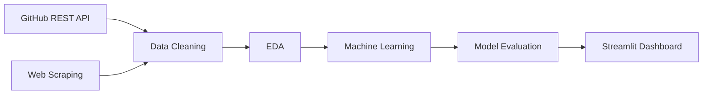

<div align="center">

# 🚀 GitHub Trending Repository Analytics

### End-to-End Data Science Pipeline for Repository Intelligence & Success Prediction

*A production-inspired data science project that collects, analyzes, and predicts GitHub repository performance using web scraping, REST APIs, machine learning, and interactive business intelligence dashboards.*


</div>

---

# 📖 Overview

Open-source repositories generate massive amounts of data every day—from stars and forks to contributions, programming languages, and community engagement.

This project demonstrates an end-to-end data science workflow that collects repository data from GitHub, performs exploratory analysis, applies machine learning techniques, and presents interactive visualizations through a Streamlit dashboard.

The objective is to uncover the characteristics of successful repositories and build predictive models capable of estimating repository success.

---

# ✨ Core Features

## 🌐 Data Collection

Repository information is collected using:

- GitHub REST API
- Web Scraping
- Automated Data Extraction
- Data Cleaning & Validation

---

## 📊 Exploratory Data Analysis

Analyze repository characteristics including:

- Star Growth
- Fork Activity
- Contributor Trends
- Language Distribution
- Repository Popularity
- License Adoption
- Community Engagement

---

## 🤖 Machine Learning

The project applies multiple machine learning techniques:

### 📌 Clustering

Identify groups of repositories with similar characteristics using **K-Means Clustering**.

---

### 🎯 Classification

Predict repository success using supervised learning models.

---

### 📈 Feature Importance

Determine which repository characteristics contribute most to popularity and long-term growth.

---

## 📊 Interactive Dashboard

Explore results through an interactive Streamlit application featuring:

- Live Repository Metrics
- Comparative Analysis
- Trend Visualizations
- Repository Recommendations
- Predictive Insights

---

# 🏗 Project Workflow



---

# 📈 Analytics Engine

The project investigates several aspects of repository performance.

### ⭐ Repository Growth

- Stars
- Forks
- Watchers
- Contributors

---

### 💻 Technology Trends

- Programming Language Popularity
- Framework Usage
- License Distribution
- Repository Categories

---

### 📊 Statistical Analysis

- Correlation Analysis
- Distribution Analysis
- Trend Detection
- Comparative Metrics

---

### 🤖 Predictive Analytics

- Repository Success Prediction
- Repository Clustering
- Feature Importance
- Recommendation Insights

---

# 📊 Sample Insights

Examples of business and technical insights include:

- Relationship between contributor activity and repository popularity
- Programming languages associated with faster repository growth
- Characteristics shared by highly successful open-source projects
- Predictive models estimating repository success
- Repository recommendation strategies based on historical trends

---

# 🚀 Machine Learning Concepts Demonstrated

- Supervised Learning
- Unsupervised Learning
- Feature Engineering
- Classification Models
- K-Means Clustering
- Feature Importance Analysis
- Model Evaluation
- Predictive Analytics

---

# 🛠 Technology Stack

| Category | Technology |
|-----------|------------|
| Programming | Python |
| Data Collection | Requests, BeautifulSoup4 |
| API | GitHub REST API |
| Data Processing | Pandas, NumPy |
| Machine Learning | Scikit-learn |
| Statistical Analysis | SciPy |
| Visualization | Plotly, Matplotlib |
| Dashboard | Streamlit |

---

# 📂 Project Structure

```
GitHub-Trending-Analytics
│
├── data/
├── notebooks/
├── models/
├── dashboard/
├── src/
├── requirements.txt
└── README.md
```

> *Update the structure above if your repository layout differs.*

---

# 🎯 Skills Demonstrated

- Web Scraping
- REST API Integration
- Data Cleaning
- Exploratory Data Analysis
- Machine Learning
- Feature Engineering
- Data Visualization
- Dashboard Development
- Statistical Analysis
- Predictive Modeling

---

# 📈 Project Highlights

| Feature | Included |
|----------|-----------|
| Web Scraping | ✅ |
| GitHub API Integration | ✅ |
| Data Cleaning | ✅ |
| EDA | ✅ |
| Machine Learning | ✅ |
| Clustering | ✅ |
| Classification | ✅ |
| Feature Importance | ✅ |
| Interactive Dashboard | ✅ |

---

# ⚙ Getting Started

Clone the repository:

```bash
git clone https://github.com/your-username/github-trending-analytics.git
```

Install the required dependencies:

```bash
pip install -r requirements.txt
```

Launch the Streamlit dashboard:

```bash
streamlit run app.py
```

---

# 📊 Dashboard

The interactive dashboard enables users to explore:

- ⭐ Repository Growth Metrics
- 📈 Trend Analysis
- 💻 Programming Language Insights
- 🤖 Machine Learning Predictions
- 📊 Repository Comparisons
- 🎯 Success Recommendations

---

# 💡 Why This Project?

Understanding what makes an open-source repository successful requires combining data engineering, statistical analysis, and machine learning.

This project demonstrates a complete analytics pipeline—from collecting raw GitHub data to generating predictive insights through machine learning models and interactive dashboards. It highlights practical skills in data science, software engineering, and business intelligence while addressing a real-world analytical problem.
